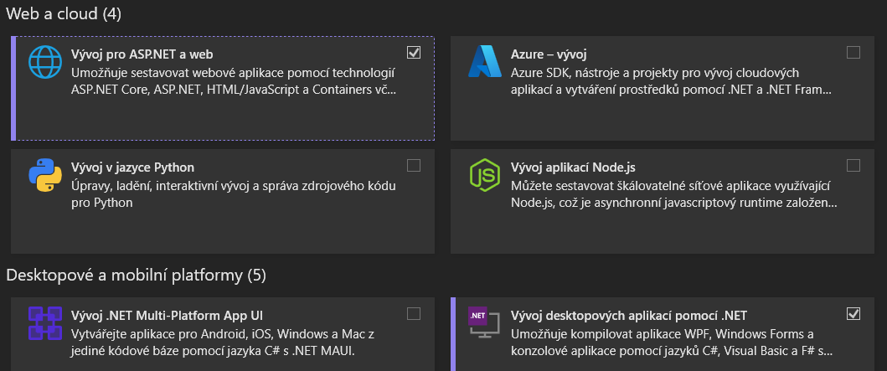
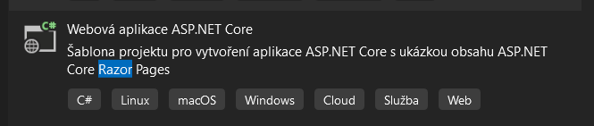

# GUI
ASP .NET RAZOR

# Project Initialization
## Requirements

To create the application, you will need:

1. Visual Studio - free to download here: https://visualstudio.microsoft.com/downloads/
2. ASP.NET
3. .NET 6.0 SDK

During installation, make sure to select **ASP.NET and Web Development**



## Creating an ASP.NET Application
After opening Visual Studio, follow these steps:

1. Create a new project
2. Choose ASP.NET Core Web Application


After creating the project, the folder structure should look like this:
```bash
/Pages
   /Shared
   /Index.cshtml
   ...
/wwwroot
/Dependencies
/appsettings.json
Program.cs
```

## Installing Packages
To communicate with the database, we will use Entity Framework, which needs to be installed first. Follow these steps:

1. Right-click on **Dependencies** in the project
2. Manage NuGet Packages
3. Search for and install the following packages: **Microsoft.EntityFrameworkCore.SqlServer** and **Microsoft.EntityFrameworkCore.Tools**

## Creating the Database

1. Create a folder **Data** where the DbContext will be stored
2. Create the file **RazorDbContext.cs**
```csharp
using Microsoft.EntityFrameworkCore;

namespace Razor.Data
{
    public class RazorDbContext : DbContext
    {
        public RazorDbContext(DbContextOptions<RazorDbContext> options) : base(options)
        {

        }

    }
}
```
3. Create a folder **Models**, and within it, create another folder **Entities**, then create the file **Article.cs**
```csharp
using System.ComponentModel.DataAnnotations;

namespace Razor.Models.Entities
{
    public class Article
    {
        public Guid Id { get; set; }
        public string Title { get; set; }
        public string Description { get; set; }
        public DateTime CreatedAt { get; set; }
    }
}
```
4. In **RazorDbContext.cs**, add the **DbSet** to create a table in the database using Entity Framework
```csharp
using Microsoft.EntityFrameworkCore;
using Razor.Models.Entities;

namespace Razor.Data
{
    public class RazorDbContext : DbContext
    {
        public RazorDbContext(DbContextOptions<RazorDbContext> options) : base(options)
        {

        }

        public DbSet<Article> Articles { get; set; }
    }
}
```
5. Create the connection string for connecting the database to the program.

   First, add a new connection string to **appsettings.json**
```json
{
  "Logging": {
    "LogLevel": {
      "Default": "Information",
      "Microsoft.AspNetCore": "Warning"
    }
  },
  "AllowedHosts": "*",
  "ConnectionStrings": {
    "RazorConnectionString": "server = ; database = ; trusted_connection = true"
  }
}
```
The connection string requires three details: server, database, and whether the connection is trusted.

To find the server name, go to **View -> SQL Server Object Explorer**, find your local server, copy its name, and put it in the connection string.

The database value is just the name of the database.

```json
{
  "Logging": {
    "LogLevel": {
      "Default": "Information",
      "Microsoft.AspNetCore": "Warning"
    }
  },
  "AllowedHosts": "*",
  "ConnectionStrings": {
    "RazorConnectionString": "server = ; database = RazorDb; trusted_connection = true"
  }
}
```
6. Add the connection string to the program.

In **Program.cs**, add **AddDbContext**:
```csharp
using Microsoft.EntityFrameworkCore;
using Razor.Data;

builder.Services.AddDbContext<RazorDbContext>(options =>
    options.UseSqlServer(builder.Configuration.GetConnectionString("RazorConnectionString")));
```
7. Create Migrations to generate tables in the database.

Open the NuGet Console via **Tools -> NuGet Package Manager -> Package Manager Console**.

Create the migration:
```bash
Add-Migration "Initial"
```
Then use this migration to create the table:
```bash
Update-Database
```

## Creating the Add Page

In the **Pages** folder, create a new folder **Articles**. Inside that folder, create a new Razor Page as follows: **Articles -> Razor Page -> Razor Page - Empty**, and name it **Add.cshtml**.

**Add.cshtml** will look like this:
```csharp
@page
@model Razor.Pages.Articles.AddModel
@{
}

<form method="post">
<!-- class="mb-3" is a Bootstrap style, margin-bottom 16px -->
<h1 class="mb-3">Add New Article</h1>

<div class="mb-3">
    <label class="form-label">Title</label>
    <input type="text" class="form-control" required/>
</div>

<div class="mb-3">
    <label for="description" class="form-label">Description</label>
    <!-- Textarea is a larger input field for larger chunks of text -->
    <textarea id="description" class="form-control" rows="5" required></textarea>
</div>

<div class="mb-3">
    <button type="submit" class="btn btn-primary">Save</button>
</div>
</form>
```
Once the page is created, a form will appear for adding posts.

To view the page, append **/Articles/Add** to your **localhost/xxxx** URL. For example: **localhost:7152/Articles/Add**.

After submitting the form, a method will be triggered, which we will create shortly. To add the new method, open the code for the page **Add.cshtml.cs** by pressing **F7**. Then, add the new method:
```csharp
// Because we use the post method to send form data
public void OnPost()
{
}
```

Next, in order to retrieve the data sent by our form from the Razor page **Add.cshtml**, we need to create a new **ViewModel**.

In the **Models** folder, create a new subfolder called **ViewModels**, and within it create a new class called **AddArticleViewModel.cs**.

In the **AddArticleViewModel** class, add the following code:
```csharp
public class AddArticleViewModel
{
    public string Title { get; set; }
    public string Description { get; set; }
    public DateTime CreatedAt { get; set; }
}
```
This class will handle sending data from the Razor page **Add.cshtml** to the backend code in **Add.cshtml.cs**. The **AddArticleViewModel** class contains the same properties as **Models->Entities->Article.cs**, except for the ID, as we will generate the ID ourselves. We only need the information displayed on the form in **Add.cshtml**.

Now, add a new property **AddArticleRequest** to **Add.cshtml.cs**:
```csharp
using Microsoft.AspNetCore.Mvc;
using Microsoft.AspNetCore.Mvc.RazorPages;
using Razor.Models.ViewModels;

namespace Razor.Pages.Articles
{
    public class AddModel : PageModel
    {
        // BindProperty is here because we need to get information (Title, Description) from the form. This code will be bound with the Razor page.
        [BindProperty]
        public AddArticleViewModel AddArticleRequest { get; set; }

        public void OnGet()
        {
        }

        // Because we use the post method to send form data
        public void OnPost()
        {
        }
    }
}
```
**[BindProperty]** is used so that the form data will be stored in the property after submission. Now we can use our new property **AddArticleRequest** in the Razor page **Add.cshtml**.

Modify **Add.cshtml** like this:
```csharp
<form method="post">
<h1 class="mb-3">Add New Article</h1>

<div class="mb-3">
    <label class="form-label">Title</label>
    <!-- We added the asp-for="AddArticleRequest.Title" so our property will store the value like [Title = <our title name>] -->
    <input type="text" class="form-control" asp-for="AddArticleRequest.Title" required/>
</div>

<div class="mb-3">
    <label class="form-label">Description</label>
    <!-- Textarea is a larger input field for larger chunks of text -->
    <textarea id="description" class="form-control" asp-for="AddArticleRequest.Description" rows="5" required></textarea>
</div>

<div class="mb-3">
    <button type="submit" class="btn btn-primary">Save</button>
</div>
</form>
```
We don't need the **ID** because **Entity Framework** will generate the ID automatically.

### Adding an Article

Now, in the **OnPost** method, we can read from our **AddArticleRequest** property, which contains data from the form. We will use **Entity Framework** to create a new article. We need to use our **dbContext**, as it acts as a bridge between **Entity Framework** and our **database**.

Modify **Add.cshtml.cs** as follows:

```csharp
using Microsoft.AspNetCore.Mvc;
using Microsoft.AspNetCore.Mvc.RazorPages;
using Razor.Data;
using Razor.Models.Entities;
using Razor.Models.ViewModels;
using System.Reflection;

namespace Razor.Pages.Articles
{
    public class AddModel : PageModel
    {
        //dbContext is handled by the application in Program.cs. 
        //We get instance of dbContext which we will use in the OnPost() method.
        private readonly RazorDbContext dbContext;

         public AddModel(RazorDbContext dbContext) 
        {
            this.dbContext = dbContext;
        }
        
        //BindProperty is here, 'cause we need to get information(Title, Description) from the form. This code will be binded with the Razor page
        [BindProperty]
        public AddArticleViewModel AddArticleRequest { get; set; }
        public void OnGet()
        {
        }
        //Because we use post method to send form data
        public void OnPost() 
        {
            AddArticleRequest.CreatedAt = DateTime.Now;
            //Convert ViewModel to EntitiesModel, 'cause dbContext cares only about Entities model
            var articleEntitiesModel = new Article
            {
                //Map fields that we are getting from the ViewModel
                Title = AddArticleRequest.Title,
                Description = AddArticleRequest.Description,
                CreatedAt = AddArticleRequest.CreatedAt,
            };
            //Use EntitiesModel to pass it to the Entity.Framework to the database
            dbContext.Articles.Add(articleEntitiesModel);
            //Make changes in the database
            dbContext.SaveChanges();

            //Notification that we successfully created an article 
            ViewData["Message"] = "Article created succesfully.";
        }
    }
}
```

To display a message confirming that the post was successfully saved, modify **Add.cshtml** as follows:

```csharp
@page
@model Razor.Pages.Articles.AddModel
@{
	//Get the string from code behind the Razor page, ViewData["message"]?.ToString(); means if not null, convert to string
	var message = ViewData["message"]?.ToString();
}

<form method="post">
	<!--class="mb-3" is style from Bootstrap, margin-bottom 16px-->
<h1 class="mb-3">Add New Article</h1>

	<!--If message if not empty-->
	@if (!string.IsNullOrEmpty(message)){
		<div class="alert alert-success" role="alert">
			@message
		</div>
	}

<div class="mb-3">
	<label class="form-label">Title</label>
		<!--We added the asp-for="AddArticleRequest.Title" so our property will store the value like [Title = <our title name>]-->
		<input type="text" class="form-control" asp-for="AddArticleRequest.Title" required/>
</div>

<div class="mb-3">
		<label for="description" class="form-label">Description</label>
		<!--Textarea is bigger input field for bigger chunk of text-->
		<textarea id="description" class="form-control" asp-for="AddArticleRequest.Description" rows="5" required></textarea>

</div>

<div class="mb-3">
	<button type="submit" class="btn btn-primary">Save</button>
</div>
</form>
```

## Adding a List Page

Now, we will create a new Razor page to display posts from the database.

Add a new file to the **Articles** folder, which is located in the **Pages** folder. Create a new Razor page as follows: **Articles -> Razor Page -> Razor Page - Empty** and name it **List.cshtml**.

View the page code using the **F7** shortcut. The page code will look like this:

```csharp
using Microsoft.AspNetCore.Mvc;
using Microsoft.AspNetCore.Mvc.RazorPages;
using Razor.Data;

namespace Razor.Pages.Articles
{
    public class ListModel : PageModel
    {
        //Like in Add.cshtml.cs we need to create this property so we can use it in the OnGet() method
        private readonly RazorDbContext dbContext;
        
        public List<Models.Entities.Article> Articles { get; set; }
        
        public ListModel(RazorDbContext dbContext)
        {
            this.dbContext = dbContext;
        }
        public void OnGet()
        {
            //Get all articles from the table Articles
            Articles = dbContext.Articles.ToList();
        }
    }
}
```

Our articles from the database will be stored in the **Articles** list property, and now we need to display them on our **List.cshtml** Razor page.

Now, let's structure the **List.cshtml** page:

```csharp
@page
@model Razor.Pages.Articles.ListModel
@{
}

<h1 class="mb-3">List of Articles</h1>

<!--Create table only if some Article exist-->
@if (Model.Articles != null && Model.Articles.Any())
{

	<table>
    <thead>
        <tr> <!--Row-->
          <th>Id</th> <!--Column-->
          <th>Title</th>
          <th>Description</th>
          <th>CreatedAt</th>
        </tr>
    </thead>
    <tbody>
        <!--Get all articles-->
        @foreach(var article in Model.Articles){
            <tr>
                    <td>@article.Id</td>
                    <td>@article.Title</td>
                    <td>@article.Description</td>
                    <td>@article.CreatedAt</td>
            </tr>
        }
    </tbody>
</table>
}
else{
    <p>No articles found!</p>
}
```

When running the application, we want to display our newly created **List** page. To do this, enter the following in the browser: **localhost/xxxx/Articles/List**. For example: **localhost:7152/Articles/List**. Our created articles will then be displayed on the page.

## Editing the Menu

To add pages to the menu, we need to modify the **\_Layout.cshtml** file, which is located in **Pages -> Shared**. Find the **`<nav>`** tag and within it, locate the **`<ul>`** tag. Modify it as follows:

```csharp
<ul class="navbar-nav flex-grow-1">
    <li class="nav-item">
        <a class="nav-link text-dark" asp-area="" asp-page="/Index">Home</a>
    </li>
    <li class="nav-item">
        <a class="nav-link text-dark" asp-area="" asp-page="/Articles/Add">Add Article</a>
    </li>
    <li class="nav-item">
        <a class="nav-link text-dark" asp-area="" asp-page="/Articles/List">List Articles</a>
    </li>
</ul>
```

Now, we will see our pages in the menu.

## Creating an Edit Page

In the **Articles** folder, create a new Razor page using the following steps: **Articles -> Razor Page -> Razor Page - Empty**, and name it **Edit.cshtml**.

To edit specific posts, we need to know the ID of the post:

```csharp
@page "{id:Guid}"
@model Razor.Pages.Articles.EditModel
@{
}
```

To add a new method, open the code for the **Edit.cshtml.cs** class and then add a new method:

```csharp
public void OnGet(Guid id)
{
    
}
```

In **Edit.cshtml**, add the following:

```csharp
<form method="post">
	<h1 class="mb-3">Edit Article</h1>
	<div class="mb-3">
	<label class="form-label">Id</label>
	
	<input type="text" class="form-control" asp-for="EditArticleViewModel.Id" readonly/>
</div>

<div class="mb-3">
	<label class="form-label">Title</label>
	
	<input type="text" class="form-control" asp-for="EditArticleViewModel.Title" required/>
</div>

<div class="mb-3">
	<label for="description" class="form-label">Description</label>
	<!--Textarea is bigger input field for bigger chunk of text-->
	<textarea id="description" class="form-control" asp-for="EditArticleViewModel.Description" rows="5" required></textarea>

</div>

<div class="mb-3">
	<label class="form-label">Created At</label>

	<input type="date" class="form-control" asp-for="EditArticleViewModel.CreatedAt" readonly />
</div>

<div class="mb-3 d-flex justify-content-between">
	<button type="submit" class="btn btn-primary" asp-page-handler="Edit">
		Edit
	</button>
	<button type="submit" class="btn btn-danger" asp-page-handler="Delete">
		Delete
	</button>
</div>
</form>
```

Now, to load data into the form on our **Edit.cshtml** Razor page, we need to create a new ViewModel.

In the **ViewModels** folder, create a new class named **EditArticleViewModel.cs**:

```csharp
public class EditArticleViewModel
 {
     public Guid Id { get; set; }
     public string Title { get; set; }
     public string Description { get; set; }
     public DateTime CreatedAt { get; set; }
 }
```

Next, add a new property to **Edit.cshtml.cs**:

```csharp
public EditArticleViewModel EditArticleViewModel { get; set; }
```

We need to use our **dbContext**, as it acts as a bridge between **Entity Framework** and our database. Modify **Edit.cshtml.cs** as follows:

```csharp
public void OnGet(Guid id)
{
    var article = dbContext.Articles.Find(id);

    if (article != null)
    {
        // Domain Model => View Model
        EditArticleViewModel = new EditArticleViewModel()
        {
            Id = article.Id,
            Title = article.Title,
            Description = article.Description,
            CreatedAt = article.CreatedAt

        };
    }
}
```

Now, to send the updated data back after editing the form, we need to create the **OnPostEdit()** method, which looks like this:

```csharp
public void OnPostEdit()
{

    if (EditArticleViewModel != null)
    {
        var theArticle = dbContext.Articles.Find(EditArticleViewModel.Id);
        if( theArticle != null)
        {


            theArticle.Title = EditArticleViewModel.Title;
            theArticle.Description = EditArticleViewModel.Description;

            dbContext.SaveChanges();

            ViewData["Message"] = "Article updated successfully";

        }
    }
}
```

This method will send form data to the database.

To display a message confirming that the post was successfully updated, modify **Edit.cshtml** as follows:

```csharp
@page "{id:Guid}"
@model Razor.Pages.Articles.EditModel
@{
	var message = ViewData["Message"]?.ToString();
}


<form method="post">
	<h1 class="mb-3">Edit Article</h1>
	@if (!string.IsNullOrWhiteSpace(message))
	{
		<div class="alert alert-success" role="alert">
			@message
		</div>	
	}
	<div class="mb-3">
	<label class="form-label">Id</label>
	
	<input type="text" class="form-control" asp-for="EditArticleViewModel.Id" readonly/>
</div>

<div class="mb-3">
	<label class="form-label">Title</label>
	
	<input type="text" class="form-control" asp-for="EditArticleViewModel.Title" required/>
</div>

<div class="mb-3">
	<label for="description" class="form-label">Description</label>
	<!--Textarea is bigger input field for bigger chunk of text-->
	<textarea id="description" class="form-control" asp-for="EditArticleViewModel.Description" rows="5" required></textarea>

</div>

<div class="mb-3">
	<label class="form-label">Created At</label>

	<input type="date" class="form-control" asp-for="EditArticleViewModel.CreatedAt" readonly />
</div>

<div class="mb-3 d-flex justify-content-between">
	<button type="submit" class="btn btn-primary" asp-page-handler="Edit">
		Edit
	</button>
	<button type="submit" class="btn btn-danger" asp-page-handler="Delete">
		Delete
	</button>
</div>
</form>
```

Since we have two buttons within one form, each button should trigger a different method. Razor provides the **asp-page-handler** attribute for this purpose.

Now, let's add a method to delete a post using **OnPostDelete()**:

```csharp
public IActionResult OnPostDelete()
{
    var theArticle = dbContext.Articles.Find(EditArticleViewModel.Id);

    if (theArticle != null)
    {
        dbContext.Articles.Remove(theArticle);
        dbContext.SaveChanges();

        return RedirectToPage("/Articles/List");
    }
    return Page();
}
```

## Basic Styling

Updated **Index.cshtml** page:

```csharp
@page
@model IndexModel
@{
    ViewData["Title"] = "Home page";
}

<div class="text-center">
    <h1 class="display-4">Welcome to my blog</h1>
    <p>You can add, edit and delete articles. It's a simple blog for learning Razor pages with Entity.Framework</p>
    
    
</div>
```

Updated **List.cshtml** page:

```csharp
@page
@model Razor_GUI.Pages.Articles.ListModel
@{
}

<h1 class="mb-3">List of Articles</h1>

<!--Create table only if some Article exist-->
@if (Model.Articles.Any())
{
    <table class="table table-striped table-bordered mt-3">
        <thead class="thead-dark">
            <tr>
                <th>ID</th>
                <th>Title</th>
                <th>Description</th>
                <th>Created At</th>
                <th>Actions</th>
            </tr>
        </thead>
        <tbody>
            @foreach (var article in Model.Articles)
            {
                <tr>
                    <td>@article.Id</td>
                    <td>@article.Title</td>
                    <td>
                        <!--Scrollable if too long-->
                        <div style="max-height: 7.5em; overflow-y: auto; white-space: pre-wrap;">
                            @article.Description
                        </div>
                    </td>
                    <td>@article.CreatedAt.ToString("dd-MM-yyyy HH:mm")</td>
                    <td>
                        <a href="/Articles/Edit/@article.Id" class="btn btn-sm btn-primary">Edit</a>
                    </td>
                </tr>
            }
        </tbody>
    </table>
}
else
{
    <div class="alert alert-warning text-center mt-3">
        <p>No articles found!</p>
    </div>
}
```
