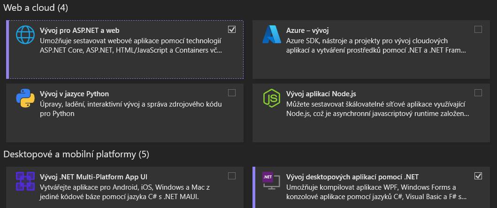
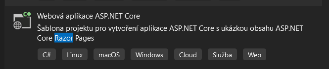

# GUI
ASP .NET RAZOR

# Inicializace projektu
## Požadavky

K vytvoření aplikace bude potřeba:

1. Visual studio - zdarma ke stažení zde:https://visualstudio.microsoft.com/cs/downloads/
2. ASP.NET
3. .NET 6.0 SDK

při instalaci nutné vybrat **Vývoj pro ASP.NET a web**



## Vytvoření ASP.NET aplikace
Po otevření Visual studia následujte tyto kroky:

1. Vytvořit nový projekt
2. Webová aplikace ASP.NET Core


Po vytvoření bude složka vypadat nějak takto:
```bash
/Pages
   /Shared
   /Index.cshtml
   ...
/wwwroot
/Závislosti
/appsettings.json
Program.cs
```
## Instalace balíčků
Pro komunikaci s databází budeme využívat Entity Framework, který ale bude potřeba nejdříve nainstalovat. Následujte tedy tyto kroky:

1. V projektu klikněte pravým tlačítkem na závislosti (dependencies)
2. Spravovat balíčky NuGet
3. Dále vyhledejte balíčky **Microsoft.Entity.FrameworkCore.SqlServer** a
**Microsoft.Entity.FrameworkCore.Tools** a nainstalujte je.

## Vytvoření databáze

1. Vytvořit složku **Data** kde se boudou uchovávat DbContext
2. Vytvořit soubor **RazorDbContext.cs**
```csharp
using Microsoft.EntityFrameworkCore;

namespace Razor.Data
{
    public class RazorDbContext : DbContext
    {
        public RazorDbContext(DbContextOptions<RazorDbContext> options) : base(options)
        {

        }

    }
}
```
3. Vytvořit složku **Models** ve které vytvoříme další složku **Entities** kde vytvoříme soubor **Article.cs**

```csharp
using System.ComponentModel.DataAnnotations;

namespace Razor.Models.Entities
{
    public class Article
    {
        public Guid Id { get; set; }
        public string Title { get; set; }
        public string Description { get; set; }
        public DateTime CreatedAt { get; set; }
    }
}

```
4. Do souboru **RazorDbContext.cs** přidat **DbSet** pro vytvoření tabulky v databázi pomocí Entiti frameworku

```csharp
using Microsoft.EntityFrameworkCore;
using Razor.Models.Entities;

namespace Razor.Data
{
    public class RazorDbContext : DbContext
    {
        public RazorDbContext(DbContextOptions<RazorDbContext> options) : base(options)
        {

        }

        public DbSet<Article> Articles { get; set; }
    }
}

```
5. Vytvoření connection stringu pro připojení databáze k programu.

   Prvně přidáme do **appsetting.json** novy connection string
```json
{
  "Logging": {
    "LogLevel": {
      "Default": "Information",
      "Microsoft.AspNetCore": "Warning"
    }
  },
  "AllowedHosts": "*",
  "ConnectionStrings": {
    "RazorConnectionString": "server = ; database = ; trusted_connection = true"
  }
}

```
Do Connection strinu se uvádí 3 údaje: server, database a jestli je připojení důvěryhodné.

Název serveru lze zjistit **Zobrazit->SQL Server Object Explorer** pote najděte lokální server jeho jméno zkopírujte a dejte do connection stringu.

Údaj database slouží jen k pojmenování databáze.

```json
{
  "Logging": {
    "LogLevel": {
      "Default": "Information",
      "Microsoft.AspNetCore": "Warning"
    }
  },
  "AllowedHosts": "*",
  "ConnectionStrings": {
    "RazorConnectionString": "server = ; database = RazorDb; trusted_connection = true"
  }
}

```
6. Přidání connection stringu do programu

V program.cs přidejte **AddDbContext**

```csharp
using Microsoft.EntityFrameworkCore;
using Razor.Data;

builder.Services.AddDbContext<RazorDbContext>(options =>
    options.UseSqlServer(builder.Configuration.GetConnectionString("RazorConnectionString")));
```
7. Vytvoření Migrations pro vytvoření tabulek do databáze.

Otevřete NuGet konzoli **Nástroje->Správa balíčků NuGet->Konzole Správce balíčků**.

Vytvoření migration.

```bash
Add-Migration "Initial"
```
Následné použití této migration pro vytvoření tabulky.

```bash
Update-Database
```

